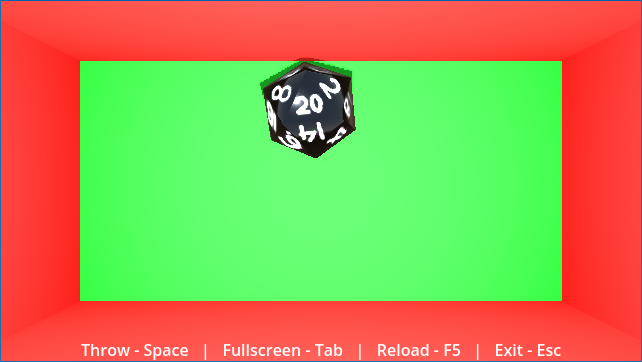

# CLAY DICE
Sometimes you just gotta roll the dice and let the chips fall where they may.

This is a dice rolling project that, in its current form, allows you to roll a twenty sided die. It launches with satisfying speed and settles quickly. But, not before bouncing wildly off the walls!

FUTURE GOALS:
- Add 4, 6, 8, 10 and 12-sided dice
- Enable player to roll several dice at once
- Enable player to create sets
- Enable player to change color of dice
- Create new and improved textures
- Add sound effects
- Decorate dice rolling area, perhaps, with Vegas-style markings

OUT OF SCOPE:
- TBD
