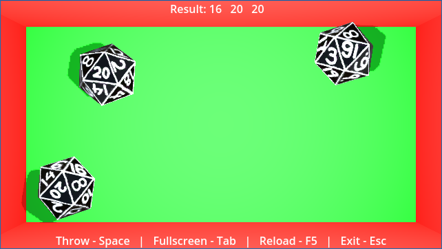

# CLAY DICE
Sometimes you just gotta roll the dice and let the chips fall where they may.

This is a dice rolling project that, in its current form, allows you to roll 4, 6, 8, 10, 12 and 20-sided dice. They launch with satisfying speed and settle quickly. But, not before bouncing wildly off the walls!

Add/remove dice with "+/-". Up to 8 dice can be added!

Change die-type with:
- 1 for 10-sided
- 2 for 20-sided
- 3 for 12-sided
- 4 for 4-sided
- 6 for 6-sided
- 8 for 8-sided

If dice land on top of each other, then the top one is automatically re-rolled after a brief settling period. A numeric result is also displayed at the top of the screen.

STRETCH GOALS:
- Enable player to turn dice lines on and off
- Enable player to change color of dice
- Enable toggle of " window always on top"
- Enable adjustment of "dice settling time"
- Add ability to save settings
- Save window position/state
- Create new and improved textures
- Further develop motif and environment
- Enable player to click a die to re-roll it
- Add sound effects
- Add roll history
- Decorate dice rolling area, perhaps, with Vegas-style markings
- Highlight mesh faces that represent each die result

COMPLETED:
- Implemented 4, 6, 8, 10, 12 and 20-sided dice
- Displayed (some) hotkeys
- Added fullscreen toggle
- Increased physics iterations and precision
- Enabled rolling multiple dice
- Enabled adding/removing dice
- Enabled switching between die types
- Added bevels to dice

OUT OF SCOPE:
- TBD

DEVELOPMENT NOTES (OPTIONAL READING):

Dice values are determined by identifying the mesh face that is most upward facing except in the case of the d4 where the most downward facing is used. 

To a degree, this allows the dice to be evaluated even when they're not perfectly flat on the ground. Although, at some angles it's hard to visually tell which face is the most updward facing.

Bevels add a lot of additional faces and we don't really want to consider those. Luckily, we maintain a list of faces to evaluate for each die. All other faces are ignored.

Initially, physics surfaces were very rough meaning that objects did not slide, which seemed nice. But, it had the adverse effect of dice sticking to walls and each other and also resting on their edges rather than settling nice and flat on the ground.

Now, surfaces are slippery smooth and the dice behave exceptionally 99.9% of the time. Every now and then a physics glitch will occur.

Speaking of glitches, in the beginning, a die would shoot through the walls every now and then, seemingly for no reason. 

Sure, the die was moving fast. But, not fast enough to explain the anomaly. So, physics iterations were doubled. No more wall penetration glitches, knock on wood, and the performance is still great!